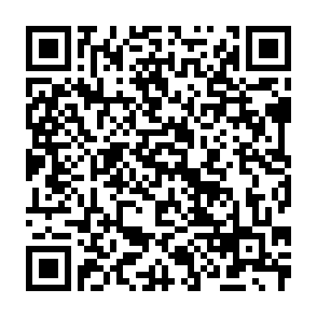

## 概要
Universal-Updater用の日本人向けStore
3gxやPretendoなどを簡単に入れられるストア
ストアの名前誰か考えて()

## ストアの追加
1. 3DSでUniversal Updaterを起動する
2. [設定(歯車)] > [UniStoreを選択......] > [追加(プラスマーク)] と選択していく
3. 左下にあるQRアイコンを選択し、次のQRをスキャンします。
